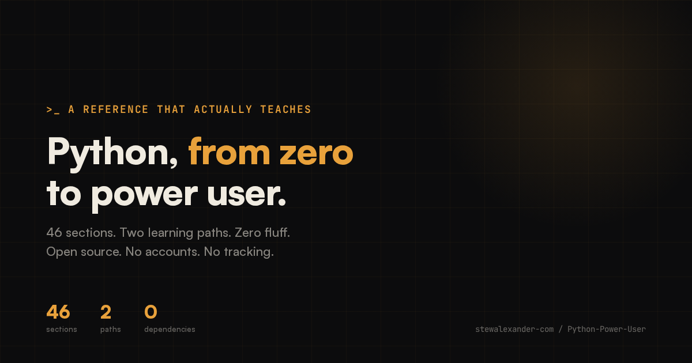
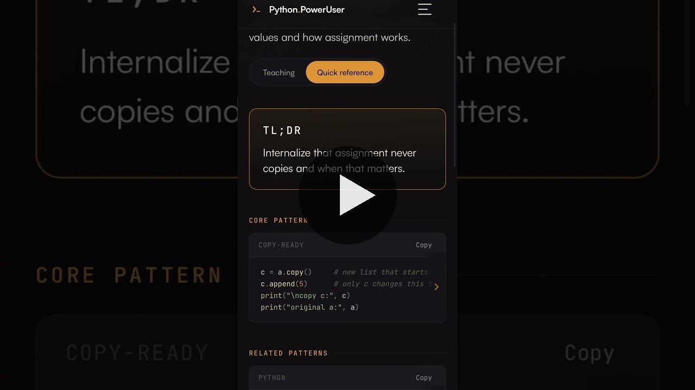
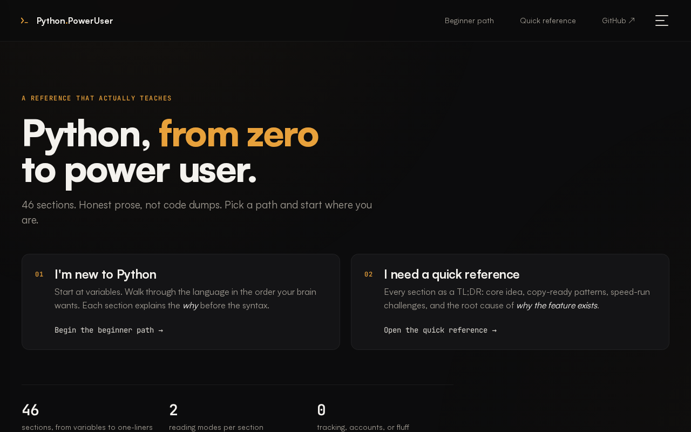
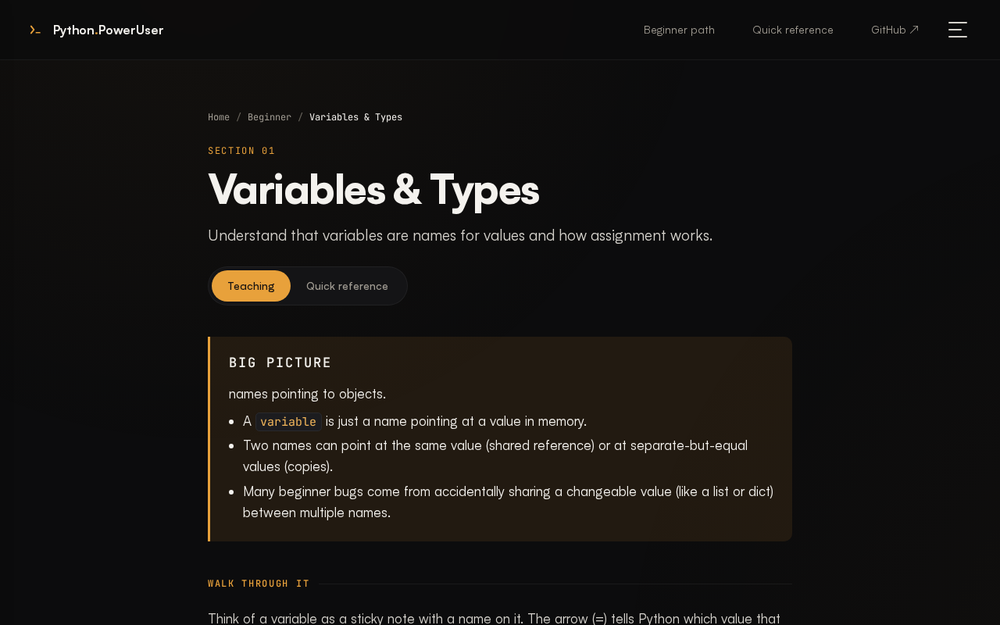
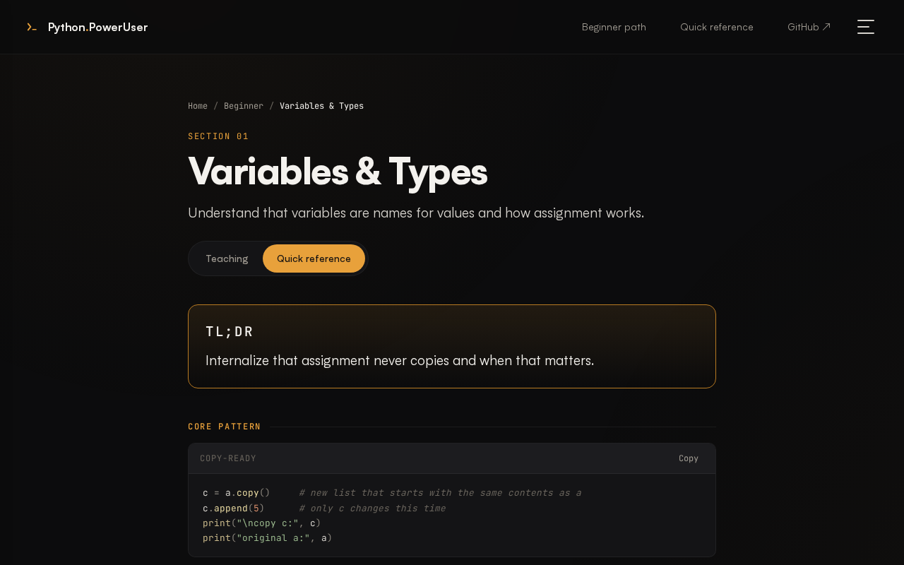
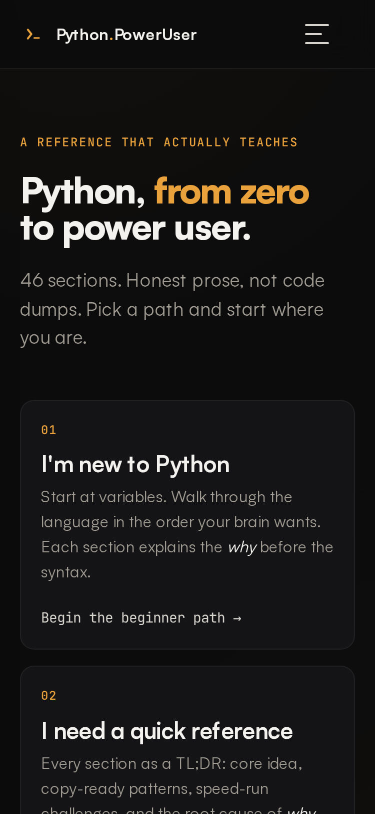
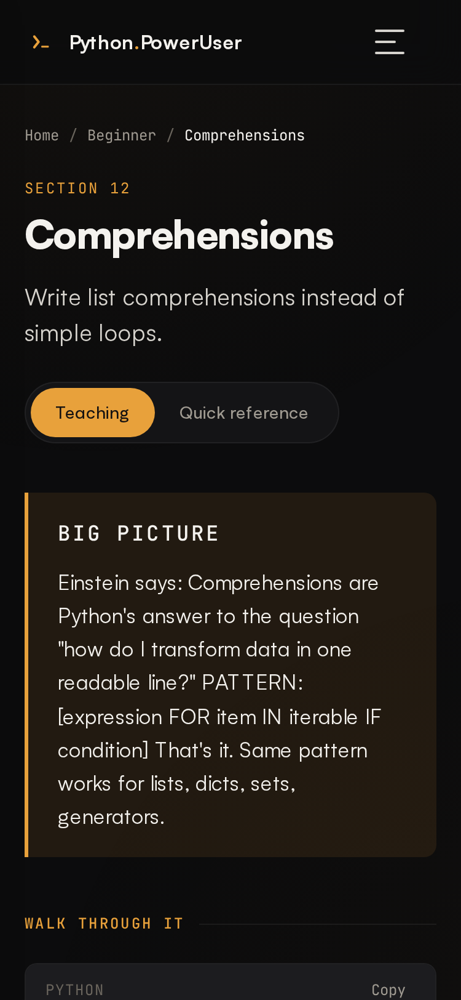

<p align="center">
  
</p>

<h1 align="center">Python Power User</h1>

<p align="center">
  <strong>A complete Python reference that actually teaches.</strong><br/>
  46 sections &middot; Two learning paths &middot; Zero dependencies<br/><br/>
  <a href="https://stewalexander-com.github.io/Python-Power-User/">Live Site</a> &middot;
  <a href="#quick-start">Quick Start</a> &middot;
  <a href="#the-quiz">Quiz</a> &middot;
  <a href="#whats-inside">What's Inside</a>
</p>

<p align="center">
  
  
  
  
</p>

<p align="center">
  <a href="https://youtube.com/shorts/eLGogARaZa8">
    
  </a><br/>
  <sub>30-second walkthrough — see the app in action</sub>
</p>

---

## TL;DR

One Python file. No installs, no frameworks, no accounts. Run it and learn — from your first variable to the patterns that separate senior devs from everyone else.

- **New to Python?** Start at Section 1, follow the beginner path
- **Already know Python?** Skim the TL;DRs and power tips, use `-s` to jump to any section
- **Prefer a browser?** Open the [live site](https://stewalexander-com.github.io/Python-Power-User/) — it's a PWA, works offline

```bash
python python_poweruser.py       # full TUI
```

---

## Web GUI

A mobile-first, dark-themed learning interface. Install it as an app on any device — no app store required.

**[→ Open the live site](https://stewalexander-com.github.io/Python-Power-User/)**

<p align="center">
  <br/>
  <sub>Home — pick a learning path</sub>
</p>

<p align="center">
  <br/>
  <sub>Teaching view — Big Picture → Walk Through → Try It Yourself</sub>
</p>

<p align="center">
  <br/>
  <sub>Quick Reference — TL;DR → Core Pattern → Speed Run → Why This Exists</sub>
</p>

<details>
<summary>Mobile screenshots</summary>
<br/>
<p align="center">
  &nbsp;&nbsp;
  
</p>
</details>

---

## The TUI

A real terminal interface — not a wall of text. Two-pane navigation, Monokai syntax highlighting, vim keys, search, and scroll.

Falls back gracefully: full curses TUI → lightweight console menu (Windows) → plain CLI (piped output).

<p align="center">
  <br/>
  <sub>Browse 46 sections with keyboard navigation</sub>
</p>

<p align="center">
  <br/>
  <sub>Monokai-themed source viewer with line numbers</sub>
</p>

---

## Quick Start

```bash
python python_poweruser.py
```

Arrow keys or `j/k` to navigate, `Enter` to open, `/` to search, `q` to quit.

```bash
python python_poweruser.py -s decorators   # jump to a section
python python_poweruser.py -f lambda        # search across all sections
python python_poweruser.py -l               # list everything
python python_poweruser.py -r               # run all demos
python python_poweruser.py -t               # take the quiz
```

Typo? It suggests what you meant. Wrong flag? It tells you why. Piped to `head`? No crash. No curses? Falls back. It handles the weird stuff so you don't have to.

---

## Download & Run

**Option 1 — Single file (zero setup)**

```bash
# Download and run. That's it.
curl -O https://raw.githubusercontent.com/StewAlexander-com/Python-Power-User/main/python_poweruser.py
python python_poweruser.py
```

**Option 2 — Clone + install as CLI tool**

```bash
git clone https://github.com/StewAlexander-com/Python-Power-User.git
cd Python-Power-User
pip install -e .
python-power-user              # now works as a command
```

---

## The Quiz

50 questions across beginner, intermediate, and advanced. Type what you think Python evaluates to, and learn from every answer — right or wrong.

- **Spaced repetition** — weak sections and missed questions appear first next time
- **Streak tracking** — 70%+ maintains your streak across sessions
- **Difficulty filter** — focus on one level or take them all
- **Smart matching** — accepts aliases, numeric tolerance, fuzzy answers

```
[6/50] What does this evaluate to?
       bool([0])

  > False
  Not quite — the answer is True
    Python asks "is the container empty?" not "are the contents truthy?"
    [0] has one element, so the list is not empty → True.
```

```bash
python python_poweruser.py -t             # quiz with progress tracking
python python_poweruser.py -t --no-save   # quiz without saving (CI / shared machines)
```

---

## Two Paths

| Path | For | Start with |
|------|-----|-----------|
| **Beginner** | New to Python | Section 1, follow in order. Run every "Try this" cell. Quiz every few sessions. |
| **Power User** | Working devs | Skim TL;DRs and `#!` power tips. Jump with `-s`. Run speed-run cells. Quiz to find blind spots. |

---

## What's Inside

| Part | Topic | Sections |
|------|-------|----------|
| 1 | **Foundations** — types that don't surprise you | Variables & Types · Numbers · Strings · Booleans |
| 2 | **Data Structures** — pick the right container | Lists · Tuples · Dicts · Sets · Advanced Structures |
| 3 | **Control Flow** — branch and loop idiomatically | Conditionals · Loops · Comprehensions |
| 4 | **Functions** — reuse, decorate, compose | Basics · Scope & Closures · Lambda · Decorators · Functools |
| 5 | **OOP** — classes through protocols | Classes · Inheritance · Dunders · Properties · ABCs |
| 6 | **Error Handling** — fail gracefully | Exceptions · Context Managers · Custom Exceptions |
| 7 | **Iterators & Generators** — lazy pipelines | Iterators · Generators · itertools |
| 8 | **File I/O** — read, write, pathlib | File Ops · JSON & CSV · Pathlib |
| 9 | **Text** — regex, formatting, time | Regex · String Formatting · Datetime |
| 10 | **Stdlib** — batteries included | Collections · OS & Subprocess · Typing |
| 11 | **The Edge** — what senior devs actually use | Idioms · Performance · Gotchas |
| 12 | **Reference** — lookup tables | Operator Precedence · Built-ins · Exception Hierarchy |
| 13 | **Tooling** — environments and debugging | Virtual Environments · Debugging & Profiling |
| 14 | **Recipes** — copy-paste one-liners | One-Liner Recipes |

Every section has Einstein/Feynman-style explanations — concepts explained so clearly you remember them, not just recognize them.

---

## VS Code Setup

Three extensions, then you're set:

1. **Python** (`ms-python.python`) — Run Cell, IntelliSense, `# %%` markers
2. **Better Comments** — colors `#*` `#!` `#?` markers used throughout
3. **Indent Rainbow** — nesting depth at a glance

`Ctrl+K Ctrl+0` to fold everything. Unfold the section you're studying. Each `# %%` is a runnable cell.

<details>
<summary>Comment markers reference</summary>

| Marker | Meaning |
|--------|---------|
| `#* Goal (Beginner)` | What a new user should learn |
| `#* Goal (Power User)` | What an experienced dev sharpens |
| `#* Big idea:` | One-line mental model |
| `#! Power tip:` | Idiom, gotcha, or performance angle |
| `#?` | Prediction prompt — answer in your head, then run |
| `#* Try this (Beginner)` | Guided practice |
| `#* Speed run (Power User)` | Challenge drills |

</details>

---

## Web GUI — Local & Hosting

```bash
# Update content after editing python_poweruser.py
python tools/build_web_content.py

# Run locally
open docs/index.html

# Host on GitHub Pages
# Settings → Pages → Deploy from branch → main → /docs
```

The site is a PWA — installable, works offline, no server required.

---

## Test Suite

```bash
python test_quiz.py         # run tests
python test_quiz.py -v      # verbose
```

Stdlib `unittest` only. Tests cover normalization, synonym expansion, NLP matching, hint tiers, and the full answer-checking pipeline.

---

## Requirements

- Python 3.10+ (uses `match/case`)
- Terminal 80×22+ for TUI
- Zero external dependencies
- `windows-curses` auto-installs on Windows if needed

---

## License

[MIT](LICENSE)

---

<p align="center">
  Built by <a href="https://github.com/StewAlexander-com">Stew Alexander</a> with the help of <a href="https://www.perplexity.ai/">Perplexity Computer</a>
</p>
