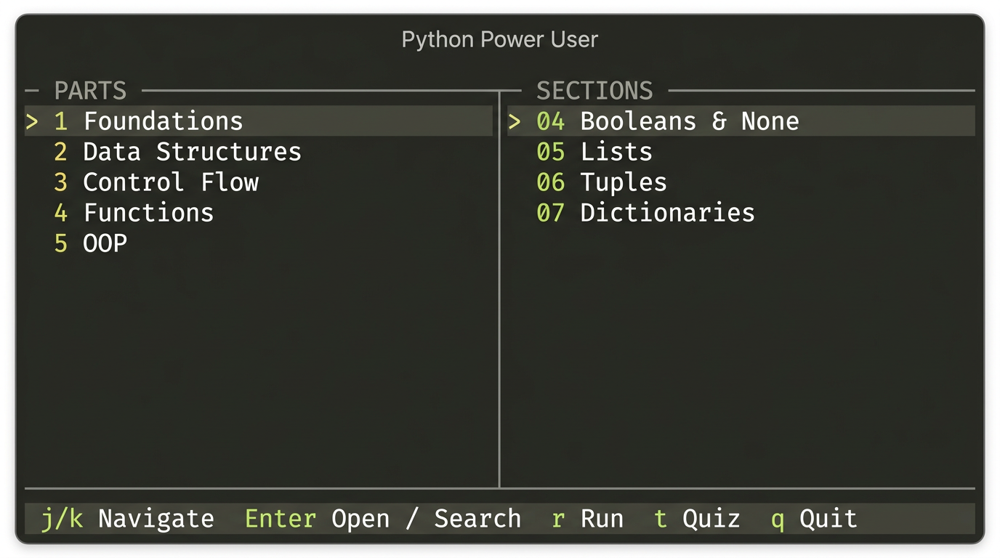
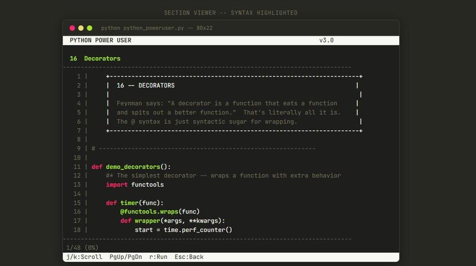

# Python Power User

A complete Python language reference and interactive learning tool in a single file. No installs, no dependencies, no setup. Just run it.

**47 sections** across 15 parts — from your first variable to the patterns that separate senior devs from everyone else. Read it in VS Code or run it in your terminal for the full experience.

Built with the help of [Perplexity Computer](https://www.perplexity.ai/).

---

## Table of Contents

- [The TUI](#the-tui)
- [Quick Start](#quick-start)
- [Download & Run](#download--run)
- [The Quiz](#the-quiz)
- [How to use this](#how-to-use-this-two-paths)
- [What's Inside](#whats-inside)
- [VS Code Setup](#vs-code-setup)
- [Test platform](#test-platform)
- [Requirements](#requirements)

---

## The TUI

<sub>[Back to TOC](#table-of-contents)</sub>

Not a wall of text. A real terminal interface with two-pane navigation, syntax highlighting, and vim keys.

On Windows, the app now falls back gracefully: full curses TUI when available, a lightweight console menu when curses isn't, and plain CLI when output is piped or non-interactive.



Browse any section's source with Monokai-themed syntax highlighting, line numbers, and scroll.



---

## Quick Start

```bash
python python_poweruser.py
```

That's it. Arrow keys or j/k to navigate, Enter to open, / to search, q to quit.

```bash
python python_poweruser.py -s decorators   # Jump straight to a section
python python_poweruser.py -f lambda        # Search across all 47 sections
python python_poweruser.py -l               # See everything at a glance
python python_poweruser.py -r               # Run all demos back to back
python python_poweruser.py -t               # Take the interactive quiz (saves progress)
python python_poweruser.py -t --no-save    # Quiz without saving (CI / shared machines)
```

Typo? It'll suggest what you meant. Wrong flag? It'll tell you why and how to fix it. Piped to `head`? No crash. No curses? Falls back gracefully. It handles the weird stuff so you don't have to.

---

## Download & Run

<sub>[Back to TOC](#table-of-contents)</sub>

You can use Python Power User in two ways: **directly from the script** or **installed as a CLI tool**.

### 1. Run the single file directly

1. Download `python_poweruser.py` from the repo (`Code → Download ZIP` or `curl`/`wget`).
2. Put it anywhere on your machine.
3. Run it with your system Python:

```bash
cd /path/to/where/you/saved/it
python python_poweruser.py          # full TUI
python python_poweruser.py -l       # list all sections
python python_poweruser.py -s dicts # jump to a section
python python_poweruser.py -t       # quiz
```

No virtualenv required, no external deps — just Python 3.10+.

### 2. Install as a global command (PyPI-style)

With the included `pyproject.toml`, you can install it in editable mode and get a `python-power-user` command:

```bash
git clone https://github.com/stewalexander/Python-Power-User.git
cd Python-Power-User
pip install -e .

python-power-user            # same as: python python_poweruser.py
python-power-user -l
python-power-user -s strings
python-power-user -t
```

This keeps the script in one file but makes it feel like a normal CLI tool.

## The Quiz

<sub>[Back to TOC](#table-of-contents)</sub>

Not a checkbox test. You read the expression, type what you think Python will do, and hit Enter.

**50 questions** across beginner, intermediate, and advanced — with an optional difficulty filter so you can focus on one level. Progress is saved to `~/.python_poweruser_progress.json`: weak sections and previously missed questions appear first next time (spaced repetition), and a streak counter encourages consistency (70%+ to maintain it).

```
  Last session: 24/50 on 2025-01-15.  Weak areas: gotchas, dicts.
  Tip: Questions from those sections will appear first today.
  🔥 3-session streak — keep the momentum!

  Difficulty filter? [A]ll / [B]eginner / [I]ntermediate / [Adv]anced (default: All): a

  [6/50] What does this evaluate to?
         bool([0])

    > False
    Not quite — the answer is True
      (Right type (bool), wrong value — good instinct!)
    Python asks "is the container empty?" not "are the contents truthy?"
    [0] has one element, so the list is not empty → True.
```

Get it right and you'll learn something extra. Get it wrong and the explanation teaches you why — with hints when you're close (right type, wrong value) or when the value is correct but the repr differs (e.g. `1` for `True`). Skipped questions show the full explanation. Answers accept aliases (`yes`/`no`, `True`/`False`), int/float cross-type (e.g. `3.0` for `3`), and fuzzy matching for longer answers.

At the end you get a score, a visual bar, and targeted study suggestions:

```
  Score: 42/50  (2 skipped)

  Answered: 48  ✓ Correct: 42  ✗ Wrong: 6  — Skipped: 2
  [████████████████████████████░░] 87%

  Next step: revisit these sections and re-run the quiz tomorrow.
  Sections worth revisiting:
    → 04 Booleans & None  (python python_poweruser.py -s booleans)
    → 07 Dictionaries  (python python_poweruser.py -s dicts)
```

- **CI / read-only home:** run without saving progress: `python python_poweruser.py -t --no-save`

**A 15-minute session looks like this:**  
1. Pick a section from `python python_poweruser.py -l` (or the TUI).  
2. Read the **Goal (Beginner)** or **Goal (Power User)** line at the top of that section.  
3. Answer each **#?** in your head, then run the **Try this (Beginner)** or **Speed run (Power User)** cells.  
4. Every few sessions, run `-t` and revisit the sections it suggests.

---

## How to use this (two paths)

<sub>[Back to TOC](#table-of-contents)</sub>

- **If you're new to Python:** Start at Part 1 and always run the **Try this (Beginner)** cells. Follow the **Goal (Beginner)** line in each section; run the quiz every few sessions and revisit the sections it lists.
- **If you already know Python:** Skim each Part's **TL;DR** and **#! Power tip** comments. Jump with `-s` and `-f`; run **Speed run (Power User)** cells and use the quiz to find weak spots.

---

## What's Inside

<sub>[Back to TOC](#table-of-contents)</sub>

| Part | Topic | Sections |
|------|-------|----------|
| 1 | Foundations — types that don't surprise you | Variables & Types, Numbers, Strings, Booleans |
| 2 | Data Structures — pick the right container fast | Lists, Tuples, Dicts, Sets, Advanced Structures |
| 3 | Control Flow — branch and loop the Pythonic way | Conditionals, Loops, Comprehensions |
| 4 | Functions — reuse, decorators, functools | Basics, Scope & Closures, Lambda, Decorators, Functools |
| 5 | OOP — classes, dunders, protocols | Classes, Inheritance, Dunders, Properties, ABCs |
| 6 | Error Handling — exceptions and context managers | Exceptions, Context Managers, Custom Exceptions |
| 7 | Iterators & Generators — lazy pipelines | Iterators, Generators, itertools |
| 8 | File I/O — read, write, pathlib | File Ops, JSON & CSV, Pathlib |
| 9 | Text Mastery — regex, formatting, datetime | Regex, String Formatting, Datetime |
| 10 | Stdlib Tools — collections, subprocess, typing | Collections, OS & Subprocess, Typing |
| 11 | The Edge — idioms, performance, gotchas that senior devs use | Idioms, Performance, Gotchas |
| 12 | Reference Tables — precedence, built-ins, exception tree | Operator Precedence, Built-ins, Exception Hierarchy |
| 13 | Env & Tooling — venvs, debugging, profiling | Virtual Environments, Debugging & Profiling |
| 14 | Recipes — copy-paste one-liners | One-Liner Recipes |
| A | Appendix — cheat sheet at a glance | Cheat Sheet |

Every section has Einstein/Feynman-style explanations that make hard concepts click fast. Comments are written to teach, not to document.

---

## VS Code Setup

<sub>[Back to TOC](#table-of-contents)</sub>

Three extensions, one-time install:

1. **Python** (`ms-python.python`) — enables Run Cell, IntelliSense, and the `# %%` cell markers
2. **Better Comments** — colors the `#*` `#!` `#?` `#TODO` markers used throughout
3. **Indent Rainbow** — makes nesting depth visually obvious

Then: `Ctrl+K Ctrl+0` to fold everything, unfold the section you're studying. Each `# %%` marker is a runnable cell.

**Comment markers used here**

| Marker | Meaning |
|--------|---------|
| `#* Goal (Beginner)` | What a new user should get from the section. |
| `#* Goal (Power User)` | What an experienced dev sharpens or unlearns. |
| `#* Big idea:` | One-line mental model. |
| `#! Power tip:` | Idiom, gotcha, or performance angle. |
| `#?` | Prediction question (answer in your head, then run). |
| `#* Try this (Beginner)` / `#* Speed run (Power User)` | Hands-on practice. |
| `#* Answers:` | Brief follow-up to Try this / Speed run (1–2 sentences). |
| `#* Quiz tag:` / `#* See also:` | Quiz alignment and cross-references to other sections. |

---

## Test platform

<sub>[Back to TOC](#table-of-contents)</sub>

A separate test script exercises the quiz and NLP answer-matching logic so changes can be validated without running the full TUI.

```bash
python test_quiz.py
python test_quiz.py -v    # verbose
```

**What it tests (stdlib `unittest` only, no pytest):**

- **`_normalize`** — quote stripping, spacing around commas/brackets/colons
- **`_synonym_expand`** — alias canonicals and prefix stripping ("the answer is 3", "returns True", etc.)
- **`_tokens_match`** — order-insensitive set/dict comparison
- **`_hint_tier`** — contextual hints (right type/wrong value, off-by-one, similarity)
- **`_check_answer`** — full pipeline: aliases, repr, synonym expansion, eval, numeric tolerance, fuzzy match; bool-only aliases rejected for non-bool
- **Integration** — `run_self_tests(no_save=True)` with mocked input completes and prints a score

Run from the repo root (same directory as `python_poweruser.py`). Exit code 0 if all tests pass.

---

## Requirements

<sub>[Back to TOC](#table-of-contents)</sub>

- Python 3.10+ (uses `match/case`)
- A terminal with at least 80×22 for the TUI
- No external dependencies — stdlib only
- `windows-curses` auto-installs on Windows if needed

### Prerequisites & classroom use

No prior coding required; basic terminal usage (run a command, move between folders) is enough. For instructors: assign specific Parts as weekly reading; have students run the quiz and revisit the sections it suggests; use `python python_poweruser.py -r` for in-class demos.

## License

MIT
